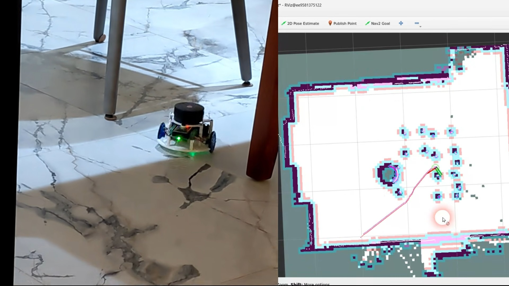

# About This Book

This book walks you through building a small self-driving robot, from a bag of parts to a robot
that maps your home and drives itself to any spot you click on the map. It follows my Maker's Pet
video course step by step, adds the fixes and tips I collected from builders after the videos
were recorded, and puts everything in one place you can read at your workbench.


## What you will build

The robot is about 120 mm across. An ESP32 microcontroller, programmed with the Arduino IDE, drives
two N20 gear motors with encoders and reads a spinning LiDAR distance sensor. Over WiFi, the ESP32
talks to ROS 2, the Robot Operating System, running on your PC. ROS 2 does the heavy lifting:
building maps, working out where the robot is, and planning a path around obstacles.

Once it's built, your robot can:

- **map your place completely on its own**, using SLAM and frontier exploration;
- **drive itself** to any location you pick on the map, avoiding obstacles along the way;
- **be driven manually** from your PC keyboard;
- **show its LiDAR readings** live on your screen;
- **run in a 3D simulation**, mapping and navigating a virtual world;
- **be reprogrammed** in Python or C++ to change its behaviour or process its sensor data.



## What you need

- **The robot parts.** The Maker's Pet *Arduino/ROS2 Self-Driving Robot 120mm Build Pack*
  (BLD-120MM-PACK) contains everything, including the BDC-30P driver board, a Maker's Pet ESP32-E dev kit and an
  LDROBOT LD14P LiDAR. If you have a 3D printer, you can print the plastic parts yourself; the
  print files are listed in Appendix C.
- **Six AA alkaline batteries.**
- **A PC** running Windows 10/11 or Ubuntu 22.04. The PC runs the robot's "brain", so a faster PC
  gives smoother mapping and navigation.
- **A 2.4 GHz WiFi network** that both the robot and the PC can join. The ESP32 can't use 5 GHz.
- **A USB data cable** for the ESP32. Some cables only carry power and won't work.
- **A small screwdriver and a wire stripper.**

No robotics experience is necessary.

**How long it takes.** If you've built a kit like this before, allow about an hour each for the
software setup, the assembly and the bring-up. For a first build, set aside a day.

## How this book is organised

| Chapter | What you do | Video |
|---|---|---|
| 1. Assemble the Robot | Put the mechanical and electrical parts together | 5 min |
| 2. Set Up the Software on a Windows PC | Install the Arduino IDE, the firmware, WSL2, Docker and an X server | 7 min |
| 3. Upload the Firmware and Bring Up the Robot | Flash the ESP32, connect it to WiFi and test the motors and LiDAR | 9 min |
| 4. Map Your Place by Driving the Robot | Drive the robot by keyboard to create your first map | 6 min |
| 5. Let the Robot Explore and Self-Drive | Autonomous exploration and navigation to goals | 6 min |
| 6. Practise in Simulation | The same mapping and navigation in a 3D simulator, no hardware needed | 10 min |
| 7. Using an Ubuntu PC Instead | Chapters 2 and 3, the Linux way | 13 min |
| Appendix A | Running Ubuntu in a virtual machine on Windows | 6 min |
| Appendix B | Troubleshooting and FAQ | |
| Appendix C | Quick reference: commands, LED codes and links | |

<div class="page-break"></div>

Pick your path:

- **Windows PC:** Chapters 1 → 2 → 3 → 4 → 5.
- **Ubuntu PC:** Chapter 1 → 7 → 4 → 5.
- **No robot yet?** Install the PC software (Chapter 2 or 7, skipping the Arduino parts), then go
  straight to Chapter 6.

Each chapter starts with a link to its video. The illustrations are frames from that video, so if
a step isn't clear from a picture, you can watch that part of the video.

## Conventions

Commands you type are shown like this:

```
docker container stop makerspet
```

Commands that start with `docker` run in a Windows PowerShell (or Ubuntu terminal) window; commands
that start with `ros2` run inside the robot software's Linux shell, which Chapter 3 shows you how
to open.

!!! update "Since the video was recorded"
    Boxes like this one mark corrections and additions made after the videos were published.
    Where the book and a video disagree, follow the book.

!!! tip
    Tips make a step easier or save you from a common mistake.

!!! warning
    Warnings protect your robot, your batteries or your PC. Please don't skip them.

## Software versions

This edition was written for Kaia.ai firmware 0.8.0 (ROS 2 Iron), the ESP32 Arduino board package
2.0.17 and the `kaiaai/kaiaai:iron` Docker image. A ROS 2 Jazzy image, `kaiaai/kaiaai:jazzy`, is
also available; see Chapter 7.

<div class="page-break"></div>

## Open source, and where to get help

Everything in this project is open source. The robot software is licensed under Apache 2.0, so
feel free to fork and modify it; please keep an acknowledgement.

If you get stuck, first check Appendix B. If it doesn't cover your problem, ask on the support forum at
[github.com/makerspet/support/discussions](https://github.com/makerspet/support/discussions) or on the
[Maker's Pet Discord server](https://discord.gg/3y2JKz5T25). Up-to-date build notes are always at
[makerspet.com/blog/bld-120mm-pack](https://makerspet.com/blog/bld-120mm-pack/).

Happy building!
