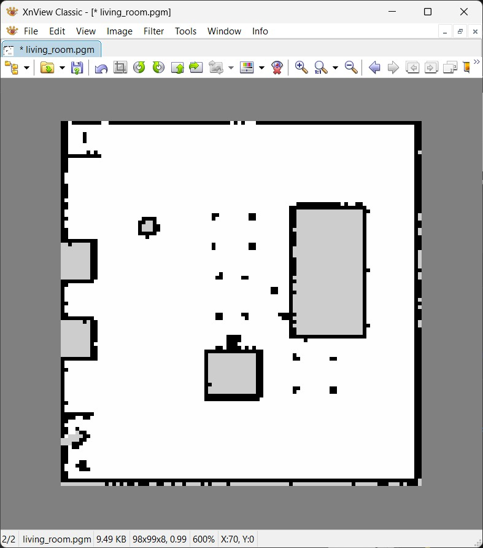

# 6. Practice in Simulation (No Robot Needed)

Video: [Simulate Arduino/ROS2 LiDAR robot using ROS2 Gazebo](https://youtu.be/7RVY4gUWgz4)
{: .video-link }

Companion article: [Tutorial: Map, Navigate ROS2 Robot in Simulation](https://makerspet.com/blog/tutorial-map-navigate-ros2-robot-in-simulation/)
{: .video-link }

You can do this chapter any time after installing the PC software, even before your kit arrives.
A simulated Maker's Pet Mini robot drives around a simulated living room in Gazebo, a 3D robot
simulator. It "sees" with a simulated LiDAR and runs the same ROS2 mapping (SLAM) and navigation
(Nav2) software as the real robot. You will:

1. start the Docker container and the Gazebo simulation,
2. drive the robot from the keyboard,
3. launch SLAM and Nav2 and watch the map build up in RViz,
4. send the robot to goals on the map until the room is explored,
5. save the map to your PC.

It takes about 15 minutes once the software is installed. The video is recorded on Windows; the
Ubuntu commands from the companion article are included too.

!!! note "What you need first"
    - **Windows PC:** WSL2, Docker Desktop, the VcXsrv X server (XLaunch), Windows PowerShell and
      the `kaiaai/kaiaai:iron` Docker image, installed as in Chapter 2.
    - **Ubuntu PC:** Docker Engine, Terminator and the `kaiaai/kaiaai:iron` image, as in Chapter 7.
    - Either way, skip the Arduino and firmware steps.
    - Optional: [XnView](https://www.xnview.com/) (or any `.pgm` viewer) to look at the saved map.

## Start Docker, the X server and PowerShell (Windows)

1. Start **Docker Desktop** and wait until it finishes "Starting the Docker Engine…".
2. On the **Images** tab, check that `kaiaai/kaiaai` with the tag `iron` is listed. If not, pull it
   as in Chapter 2.


3. Start **XLaunch**. Keep **Multiple windows**, set **Display number** to `0` (not the default
   `-1`) and finish the wizard as in Chapter 2. Gazebo and RViz windows show up on this X server.


4. Start **Windows PowerShell**.

!!! tip
    Create `C:\maps` first. The `docker run` command below shares it with the container as
    `/root/maps`, so maps you save in Docker land on your PC.

## Launch the Docker container

1. In PowerShell, start the container (copy the command from the companion article to avoid typos):

    ```
    docker run --name makerspet -it --rm -v c:\maps:/root/maps -p 8888:8888/udp -e DISPLAY=host.docker.internal:0.0 -e LIBGL_ALWAYS_INDIRECT=0 kaiaai/kaiaai:iron
    ```

   The prompt changes to something like `root@655461ab2cde:/ros_ws#`. `--name makerspet` lets you
   open more terminals in the same container later.


2. Open two more terminals. I split the window into panes (in Windows Terminal, press **Alt+Shift+-**);
   tabs or windows work too.
3. In each new one, enter the running container:

    ```
    docker exec -it makerspet bash
    ```


!!! warning
    A new pane or tab starts in plain PowerShell (`PS C:\Users\...>`), where ROS2 commands don't
    work. Run `docker exec -it makerspet bash` first and check that the prompt starts with `root@`.
    I made this mistake in the video.


### On an Ubuntu PC

Use these commands from the companion article instead (split Terminator into three terminals):

```
sudo docker run --name makerspet -it --rm -v ~/maps:/root/maps -p 8888:8888/udp -e DISPLAY -e QT_X11_NO_MITSHM=1 --volume="/tmp/.X11-unix:/tmp/.X11-unix:rw" --volume="${XAUTHORITY}:/root/.Xauthority" kaiaai/kaiaai:iron
```

```
sudo docker exec -it makerspet bash
```

Maps are saved to `~/maps`.

## Launch the Gazebo simulation

1. In the first container terminal, start the simulated world:

    ```
    ros2 launch kaiaai_gazebo world.launch.py
    ```

2. Wait for the Gazebo window; the first start takes a while. The terminal prints
   `Successfully spawned entity [makerspet_mini]`.

<div class="pair" markdown="1">


</div>

!!! note
    Ignore the ALSA / `Could not open playback device` errors: there is no sound card in Docker.

!!! tip "Moving around in Gazebo"
    Mouse wheel zooms, dragging pans. The big red ball is just an object; the robot is the small
    red disc with the black LiDAR on top.

## Drive the robot by hand

1. In the second container terminal, start keyboard teleop:

    ```
    ros2 run kaiaai_teleop teleop_keyboard
    ```

2. It lists its keys:

   - `w` / `x`: increase / decrease linear (forward) speed
   - `a` / `d`: increase / decrease angular (turning) speed
   - `s`: keep straight (stop turning)
   - `Space`: force stop
   - `CAPS`: large steps
   - `Ctrl-C`: quit


3. Click into the teleop terminal and drive. Each key press changes the speed a little. The robot
   keeps that speed until you change it; press **Space** to stop.


## Launch SLAM and Nav2

Leave Gazebo and teleop running.

1. In the third container terminal, run:

    ```
    ros2 launch kaiaai_bringup navigation.launch.py use_sim_time:=true slam:=True
    ```

   `use_sim_time:=true` uses the simulator's clock; `slam:=True` builds a new map instead of
   loading a saved one.


2. RViz opens. With SLAM, Localization shows `inactive`; that's expected. On the map, white is free
   floor, dark outlines are walls and furniture, gray-green is unexplored.


!!! tip "Arranging the windows"
    I hide the RViz side panels with the small arrow on the map's left edge and put Gazebo left,
    RViz right, terminals below. If RViz is too narrow, the **Nav2 Goal** button hides behind a `»`
    on the toolbar; widen the window.

3. Drive around a little with teleop and watch the map grow.


4. Before letting the robot drive itself, stop teleop with **Ctrl-C**, or teleop and Nav2 will
   fight over speed commands.


## Send the robot to goals

1. Click **Nav2 Goal** on the RViz toolbar.


2. Left-click and hold where you want the robot to go.
3. Drag toward the direction it should face on arrival. A green arrow shows the goal.
4. Release.


5. Nav2 plans a path (thin pink line) and the robot follows it. On arrival the navigation terminal
   prints `Reached the goal!` / `Goal succeeded`.


6. Keep setting goals, preferably at the edge of the explored (white) area, so the LiDAR sees new
   parts of the room.

<div class="pair" markdown="1">


</div>

!!! tip "If the robot gets stuck"
    If the **Recoveries** counter in the Navigation 2 panel climbs, show the side panel, click
    **Cancel** and give a closer goal.


7. Repeat until the walls form a closed outline with no gray-green left inside.


!!! note
    You can also map the whole room by hand with `teleop_keyboard`; SLAM works either way.

## Save the map

1. In a free container terminal, run:

    ```
    ros2 run nav2_map_server map_saver_cli -f ~/maps/map --ros-args -p save_map_timeout:=60.0
    ```


2. Wait for `Map saved successfully`. `map.pgm` (the map image) and `map.yaml` (size, resolution,
   origin) go to `/root/maps`, which is `C:\maps` on Windows or `~/maps` on Ubuntu.


3. Open `map.pgm` in XnView to view it.



## Shut everything down

1. Close RViz. When asked to save `navigation.rviz`, click **Discard** unless you meant to change
   the layout.


2. Press **Ctrl-C** in the navigation and Gazebo terminals and wait for them to exit.
3. Type `exit` in each container terminal. Leaving the `docker run` one stops the container, and
   `--rm` deletes it. Your map is safe in `C:\maps` (or `~/maps`) on your PC.


